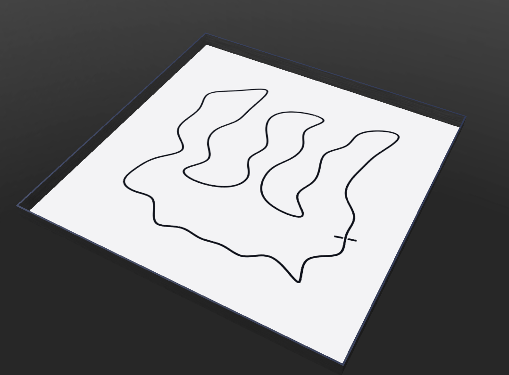
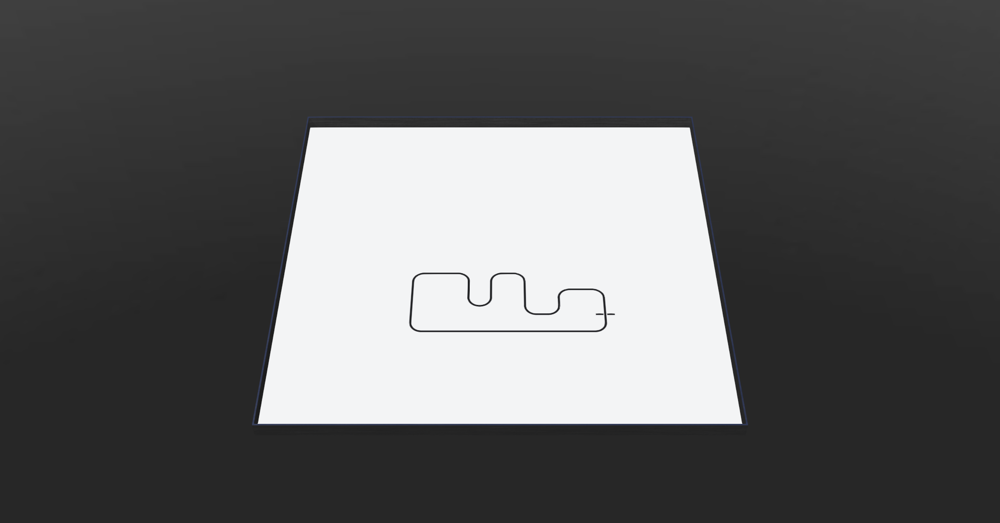
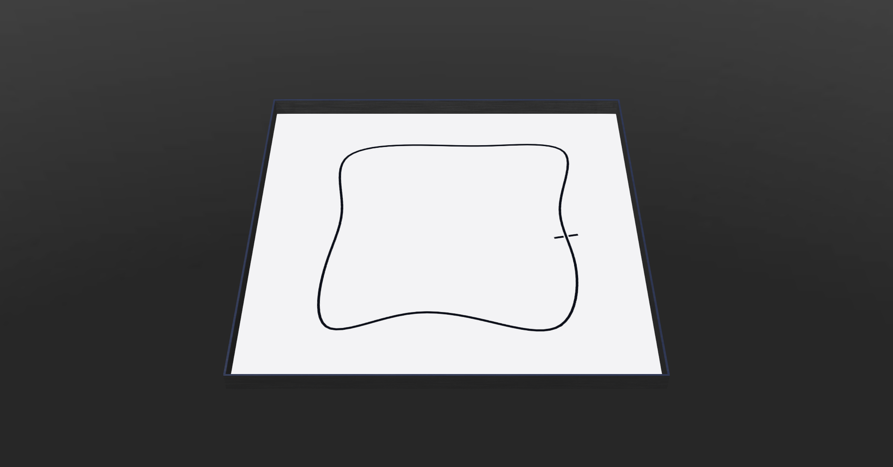

# pyLineFollowerTrackGenerator <!-- omit in toc -->
A CLI tool to generate a Webots world with a random line follower track.

[](http://choosealicense.com/licenses/mit/)
[](https://www.repostatus.org/#wip)


* [Installation](#installation)
* [Usage](#usage)
  * [Track: ETrack](#track-etrack)
  * [Track: Grid](#track-grid)
  * [Track: Simple](#track-simple)
  * [Track: \<...\>](#track-)
  * [Friction](#friction)
* [Used Libraries](#used-libraries)
* [Issues, Ideas And Bugs](#issues-ideas-and-bugs)
* [License](#license)
* [Contribution](#contribution)

# Installation
```cmd
$ git clone https://github.com/BlueAndi/pyLineFollowerTrackGenerator.git
$ cd pyLineFollowerTrackGenerator
$ pip install .
```

# Usage

## Track: ETrack
Generate a line follower track like a 'E' with the "etrack" command.

Use ```./pyLineFollowerTrackGenerator etrack --help``` to see all possible parameters.

Example: A arena 2 x 2 m generated with splines through 30 points. The line width is 1.5 cm by default.
```bash
$ ./pyLineFollowerTrackGenerator Parameters: etrack -a "Andreas Merkle" -d "Line follower track along a 'E'." -e web@blue-andi.de -mg cardboard -mr rubber -mp dry etrack
```

Files:
* [etrack.wbt](./examples/etrack/etrack.wbt)
* [etrack.png](./examples/etrack/etrack.png)

## Track: Grid
Geneate a line follower track in a fixed grid by coordinates in a JSON file.

Use ```./pyLineFollowerTrackGenerator grid --help``` to see all possible parameters.

Example: A arena 3 x 3 m generated with quarter circles. The line width is 1.5 cm by default.
```bash
$ .pyLineFollowerTrackGenerator grid -a "Andreas Merkle" -d "Line follower grid track." -e web@blue-andi.de -mg cardboard -mr rubber -mp dry -s 3 grid.wbt grid_points.json
```

Files:
* [grid_points.json](./examples/grid/grid_points.json)
* [grid.wbt](./examples/grid/grid.wbt)
* [grid.png](./examples/grid/grid.png)

## Track: Simple
Generate a simple line follower track with the "simple" command.

Use ```./pyLineFollowerTrackGenerator simple --help``` to see all possible parameters.

Example: A arena 2 x 2 m generated with splines through 12 points. The line width is 1.5 cm by default.
```bash
$ ./pyLineFollowerTrackGenerator simple simple.wbt -s=2 -np=12
```

Files:
* [simple.wbt](./examples/simple/simple.wbt)
* [simple.png](./examples/simple/simple.png)

## Track: &lt;...&gt;
You are invited to extend it with more different kind of tracks. ;-)

## Friction
Get a list of available material pairs with their friction parameters by using

```bash
$ ./pyLineFollowerTrackGenerator friction
```

or get a filtered list e.g. for steel:

```bash
$ ./pyLineFollowerTrackGenerator friction steel
```

Specify the material for the ground and for the robot contact material, as well as the material property:
```bash
$ ./pyLineFollowerTrackGenerator simple simple.wbt -s=2 -np=12 -mg cardboard -mr rubber -mp dry
```

Notes:
* Static and dynamic friction are supported.
* Only symmetric friction is supported.
* If the friction has a range, the friction will be determined random (min &lt;= friction &lt;= max).
* Find the source for the friction parameters in [friction database](./database/friction.json).
* In the [Webots contact properties](https://www.cyberbotics.com/doc/reference/contactproperties) the friction parameters are configured.
* Details about the physical simulation are explained in the [Open Physics Engine manual](https://ode.org/wiki/index.php?title=Manual#Contact), which is used by Webots.

# Used Libraries
Used 3rd party libraries which are not part of the standard Python package:

| Library | Description | License |
| - | - | - |
| [matplotlib](https://github.com/matplotlib/matplotlib) | Matplotlib is a comprehensive library for creating static, animated, and interactive visualizations in Python. | Mixed |
| [numpy](https://github.com/numpy/numpy) | NumPy is the fundamental package for scientific computing with Python. | Mixed |
| [scipy](https://github.com/scipy/scipy) | SciPy is an open-source software for mathematics, science, and engineering. | BSD-3 |
| [toml](https://github.com/uiri/toml) | Parsing [TOML](https://en.wikipedia.org/wiki/TOML) | MIT License |

# Issues, Ideas And Bugs
If you have further ideas or you found some bugs, great! Create a [issue](https://github.com/BlueAndi/pyLineFollowerTrackGenerator/issues) or if you are able and willing to fix it by yourself, clone the repository and create a pull request.

# License
The whole source code is published under the [MIT license](http://choosealicense.com/licenses/mit/).
Consider the different licenses of the used third party libraries too!

# Contribution
Unless you explicitly state otherwise, any contribution intentionally submitted for inclusion in the work by you, shall be licensed as above, without any additional terms or conditions.
